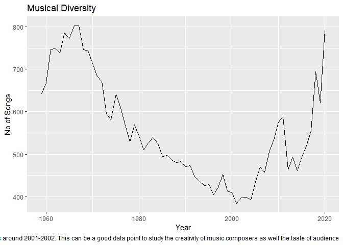
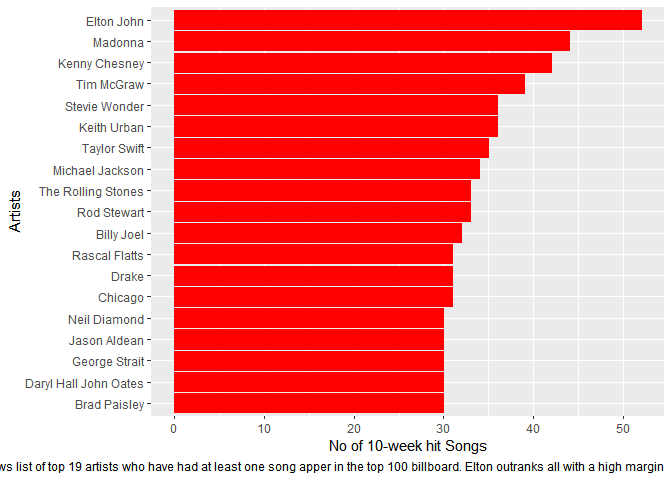
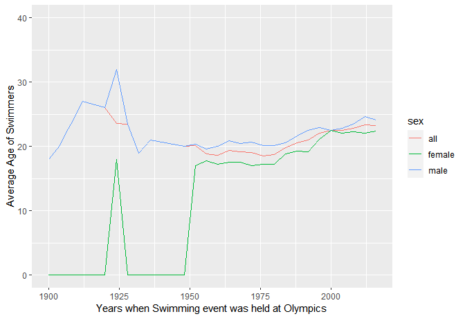
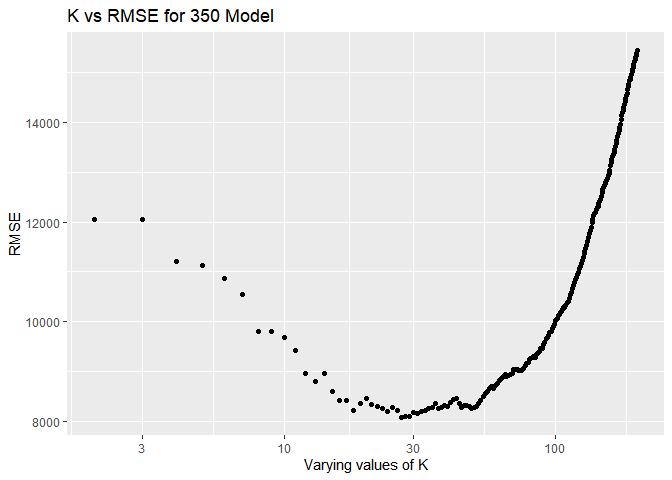
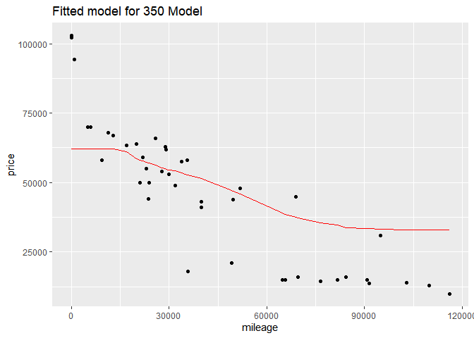
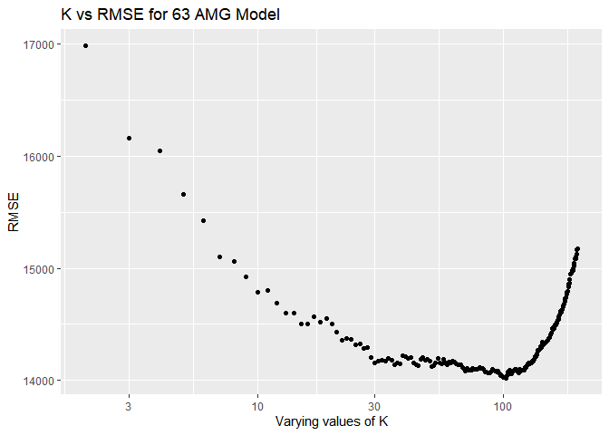
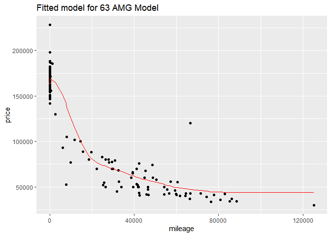

    ## Reading layer `cb_2018_us_state_20m' from data source 
    ##   `C:\Users\hp\Documents\cb_2018_us_state_20m\cb_2018_us_state_20m.shp' 
    ##   using driver `ESRI Shapefile'
    ## Simple feature collection with 52 features and 9 fields
    ## Geometry type: MULTIPOLYGON
    ## Dimension:     XY
    ## Bounding box:  xmin: -179.1743 ymin: 17.91377 xmax: 179.7739 ymax: 71.35256
    ## Geodetic CRS:  NAD83

## R Markdown

Q2\] Billboard Top 100

    ## # A tibble: 10 x 3
    ## # Groups:   song [10]
    ##    song                              performer                             count
    ##    <chr>                             <chr>                                 <int>
    ##  1 Radioactive                       Imagine Dragons                          87
    ##  2 Sail                              AWOLNATION                               79
    ##  3 Blinding Lights                   The Weeknd                               76
    ##  4 I'm Yours                         Jason Mraz                               76
    ##  5 How Do I Live                     LeAnn Rimes                              69
    ##  6 Counting Stars                    OneRepublic                              68
    ##  7 Party Rock Anthem                 LMFAO Featuring Lauren Bennett & Goo~    68
    ##  8 Foolish Games/You Were Meant For~ Jewel                                    65
    ##  9 Rolling In The Deep               Adele                                    65
    ## 10 Before He Cheats                  Carrie Underwood                         64

Q3\] Olympics Wrangling

    ## 95% 
    ## 183

    ## [1] "The 95th percentile height of female athletes is 183"

    ## [1] 10.86549

    ## [1] "Highest variation (measured in terms of std dev) is in Rowing Women's Coxed Fours event followed by Women's basketball"

Q4\]K-nearest Neighhbours

    ##            k        e
    ## result.14 15 12518.42

    ##              k       e
    ## result.117 118 13750.4

