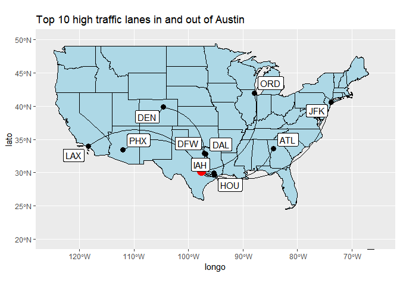

## R Markdown

Q2\] Billboard Top 100

    ## # A tibble: 10 x 3
    ## # Groups:   song [10]
    ##    song                             performer                            count
    ##    <chr>                            <chr>                                <int>
    ##  1 Radioactive                      Imagine Dragons                         87
    ##  2 Sail                             AWOLNATION                              79
    ##  3 Blinding Lights                  The Weeknd                              76
    ##  4 I'm Yours                        Jason Mraz                              76
    ##  5 How Do I Live                    LeAnn Rimes                             69
    ##  6 Counting Stars                   OneRepublic                             68
    ##  7 Party Rock Anthem                LMFAO Featuring Lauren Bennett & Go~    68
    ##  8 Foolish Games/You Were Meant Fo~ Jewel                                   65
    ##  9 Rolling In The Deep              Adele                                   65
    ## 10 Before He Cheats                 Carrie Underwood                        64

    ## # A tibble: 34,467 x 3
    ## # Groups:   year [62]
    ##     year song                                       count
    ##    <int> <chr>                                      <int>
    ##  1  1959 "\"Yep!\""                                     9
    ##  2  1959 "('til) I Kissed You"                         16
    ##  3  1959 "(All of a Sudden) My Heart Sings"            15
    ##  4  1959 "(I'll Be With You In) Apple Blossom Time"    11
    ##  5  1959 "(I Don't Care) Only Love Me"                  4
    ##  6  1959 "(I Wanna) Dance With The Teacher"             3
    ##  7  1959 "(If You Cry) True Love, True Love"            9
    ##  8  1959 "(New In) The Ways Of Love"                    7
    ##  9  1959 "(Night Time Is) The Right Time"               1
    ## 10  1959 "(Now and Then There's) A Fool Such As I"     15
    ## # ... with 34,457 more rows

    ## # A tibble: 62 x 2
    ##     year no_of_unique_songs
    ##    <int>              <int>
    ##  1  1959                641
    ##  2  1960                668
    ##  3  1961                747
    ##  4  1962                748
    ##  5  1963                739
    ##  6  1964                786
    ##  7  1965                773
    ##  8  1966                803
    ##  9  1967                802
    ## 10  1968                746
    ## # ... with 52 more rows

    ## # A tibble: 14,807 x 3
    ## # Groups:   performer [6,126]
    ##    performer                song                                            n1
    ##    <chr>                    <chr>                                        <int>
    ##  1 'N Sync                  (God Must Have Spent) A Little More Time On~    22
    ##  2 'N Sync                  Bye Bye Bye                                     23
    ##  3 'N Sync                  Gone                                            24
    ##  4 'N Sync                  I Drive Myself Crazy                            12
    ##  5 'N Sync                  I Want You Back                                 24
    ##  6 'N Sync                  It's Gonna Be Me                                25
    ##  7 'N Sync                  Pop                                             15
    ##  8 'N Sync                  This I Promise You                              26
    ##  9 'N Sync & Gloria Estefan Music Of My Heart                               20
    ## 10 'N Sync Featuring Nelly  Girlfriend                                      20
    ## # ... with 14,797 more rows

Q3\] Olympics Wrangling

    ## # A tibble: 847 x 2
    ##    name                                      ht
    ##    <chr>                                  <dbl>
    ##  1 "Aeriwentha Mae Faggs (-Starr)"          158
    ##  2 "Agnes Osazuwa (-Olatunji)"              162
    ##  3 "Aikaterini \"Ekaterini\" Stefanidi"     173
    ##  4 "Aikaterini Thanou"                      165
    ##  5 "Aileen Aletha Meagher"                  168
    ##  6 "Aleen May Bailey"                       170
    ##  7 "Aleksandra Andreyevna Fedoriva"         176
    ##  8 "Aleksandra Georgiyevna Chudina"         188
    ##  9 "Alexandra Angela \"Sandie\" Richards"   175
    ## 10 "Alice Marie Coachman (-Davis)"          170
    ## # ... with 837 more rows

    ## 95% 
    ## 183

    ## [1] "The 95th percentile height of female athletes is 183"

    ## # A tibble: 132 x 2
    ##    event                                 variation
    ##    <chr>                                     <dbl>
    ##  1 Rowing Women's Coxed Fours                10.9 
    ##  2 Basketball Women's Basketball              9.70
    ##  3 Rowing Women's Coxed Quadruple Sculls      9.25
    ##  4 Rowing Women's Coxed Eights                8.74
    ##  5 Swimming Women's 100 metres Butterfly      8.13
    ##  6 Volleyball Women's Volleyball              8.10
    ##  7 Gymnastics Women's Uneven Bars             8.02
    ##  8 Shooting Women's Double Trap               7.83
    ##  9 Cycling Women's Keirin                     7.76
    ## 10 Swimming Women's 400 metres Freestyle      7.62
    ## # ... with 122 more rows

    ## [1] 10.86549

    ## [1] "Highest variation (measured in terms of std dev) is in Rowing Women's Coxed Fours event followed by Women's basketball"

    ## # A tibble: 28 x 2
    ##     year  agem
    ##    <int> <dbl>
    ##  1  1900  18  
    ##  2  1904  20.1
    ##  3  1906  22  
    ##  4  1908  23.5
    ##  5  1912  27  
    ##  6  1920  26  
    ##  7  1924  32  
    ##  8  1928  23.5
    ##  9  1932  19  
    ## 10  1936  21  
    ## # ... with 18 more rows

    ## # A tibble: 18 x 2
    ##     year  agef
    ##    <int> <dbl>
    ##  1  1924  18  
    ##  2  1952  17  
    ##  3  1956  17.7
    ##  4  1960  17.3
    ##  5  1964  17.5
    ##  6  1968  17.5
    ##  7  1972  17  
    ##  8  1976  17.2
    ##  9  1980  17.2
    ## 10  1984  18.9
    ## 11  1988  19.3
    ## 12  1992  19.2
    ## 13  1996  21.1
    ## 14  2000  22.5
    ## 15  2004  22.1
    ## 16  2008  22.3
    ## 17  2012  22.0
    ## 18  2016  22.4

    ## # A tibble: 28 x 2
    ##     year ageall
    ##    <int>  <dbl>
    ##  1  1900   18  
    ##  2  1904   20.1
    ##  3  1906   22  
    ##  4  1908   23.5
    ##  5  1912   27  
    ##  6  1920   26  
    ##  7  1924   23.6
    ##  8  1928   23.5
    ##  9  1932   19  
    ## 10  1936   21  
    ## # ... with 18 more rows

    ##    year   ageall     agef
    ## 1  1900 18.00000       NA
    ## 2  1904 20.14286       NA
    ## 3  1906 22.00000       NA
    ## 4  1908 23.45455       NA
    ## 5  1912 27.00000       NA
    ## 6  1920 26.00000       NA
    ## 7  1924 23.60000 18.00000
    ## 8  1928 23.50000       NA
    ## 9  1932 19.00000       NA
    ## 10 1936 21.00000       NA
    ## 11 1948 20.00000       NA
    ## 12 1952 20.14286 17.00000
    ## 13 1956 18.86842 17.73333
    ## 14 1960 18.65000 17.26531
    ## 15 1964 19.40351 17.52000
    ## 16 1968 19.18710 17.54545
    ## 17 1972 19.01250 17.00000
    ## 18 1976 18.53390 17.21538
    ## 19 1980 18.75573 17.23810
    ## 20 1984 19.84211 18.86567
    ## 21 1988 20.56287 19.31579
    ## 22 1992 21.01266 19.18056
    ## 23 1996 22.02286 21.10345
    ## 24 2000 22.51351 22.53191
    ## 25 2004 22.44865 22.07447
    ## 26 2008 22.85500 22.28283
    ## 27 2012 23.33846 22.03093
    ## 28 2016 23.24211 22.38144

    ##    year   ageall     agef     agem
    ## 1  1900 18.00000       NA 18.00000
    ## 2  1904 20.14286       NA 20.14286
    ## 3  1906 22.00000       NA 22.00000
    ## 4  1908 23.45455       NA 23.45455
    ## 5  1912 27.00000       NA 27.00000
    ## 6  1920 26.00000       NA 26.00000
    ## 7  1924 23.60000 18.00000 32.00000
    ## 8  1928 23.50000       NA 23.50000
    ## 9  1932 19.00000       NA 19.00000
    ## 10 1936 21.00000       NA 21.00000
    ## 11 1948 20.00000       NA 20.00000
    ## 12 1952 20.14286 17.00000 20.38462
    ## 13 1956 18.86842 17.73333 19.60870
    ## 14 1960 18.65000 17.26531 19.98039
    ## 15 1964 19.40351 17.52000 20.87500
    ## 16 1968 19.18710 17.54545 20.40449
    ## 17 1972 19.01250 17.00000 20.65909
    ## 18 1976 18.53390 17.21538 20.15094
    ## 19 1980 18.75573 17.23810 20.16176
    ## 20 1984 19.84211 18.86567 20.61176
    ## 21 1988 20.56287 19.31579 21.60440
    ## 22 1992 21.01266 19.18056 22.54651
    ## 23 1996 22.02286 21.10345 22.93182
    ## 24 2000 22.51351 22.53191 22.49451
    ## 25 2004 22.44865 22.07447 22.83516
    ## 26 2008 22.85500 22.28283 23.41584
    ## 27 2012 23.33846 22.03093 24.63265
    ## 28 2016 23.24211 22.38144 24.13978

    ##    year   ageall     agef     agem
    ## 1  1900 18.00000  0.00000 18.00000
    ## 2  1904 20.14286  0.00000 20.14286
    ## 3  1906 22.00000  0.00000 22.00000
    ## 4  1908 23.45455  0.00000 23.45455
    ## 5  1912 27.00000  0.00000 27.00000
    ## 6  1920 26.00000  0.00000 26.00000
    ## 7  1924 23.60000 18.00000 32.00000
    ## 8  1928 23.50000  0.00000 23.50000
    ## 9  1932 19.00000  0.00000 19.00000
    ## 10 1936 21.00000  0.00000 21.00000
    ## 11 1948 20.00000  0.00000 20.00000
    ## 12 1952 20.14286 17.00000 20.38462
    ## 13 1956 18.86842 17.73333 19.60870
    ## 14 1960 18.65000 17.26531 19.98039
    ## 15 1964 19.40351 17.52000 20.87500
    ## 16 1968 19.18710 17.54545 20.40449
    ## 17 1972 19.01250 17.00000 20.65909
    ## 18 1976 18.53390 17.21538 20.15094
    ## 19 1980 18.75573 17.23810 20.16176
    ## 20 1984 19.84211 18.86567 20.61176
    ## 21 1988 20.56287 19.31579 21.60440
    ## 22 1992 21.01266 19.18056 22.54651
    ## 23 1996 22.02286 21.10345 22.93182
    ## 24 2000 22.51351 22.53191 22.49451
    ## 25 2004 22.44865 22.07447 22.83516
    ## 26 2008 22.85500 22.28283 23.41584
    ## 27 2012 23.33846 22.03093 24.63265
    ## 28 2016 23.24211 22.38144 24.13978

Q4\]K-nearest Neighhbours

    ##            k        e
    ## result.16 17 8247.823

    ##            k        e
    ## result.53 54 14352.67

